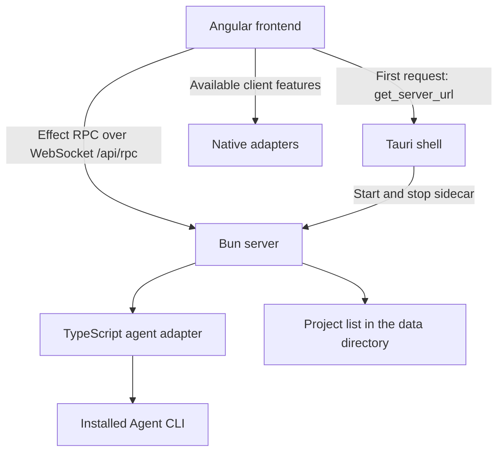

# Architecture

Eitri has an Angular frontend and a TypeScript backend running on Bun.
The standalone server uses shared Effect contracts and is bundled with `vp pack`.
Bun compiles the bundle into a standalone executable. Tauri ships that executable,
and starts one server per desktop process. The frontend talks to it over one
WebSocket, using Effect RPC.

## Transport

Every call a client makes is an Effect RPC defined once in `EitriRpcs`
(`@eitri/contracts/rpc`): its payload, answer and expected error as Effect Schemas.
The server implements the group in `apps/server/src/rpc.ts`; the client derives its
typed calls from the same group in `ServerService`. Payloads are decoded on the
server before a handler runs, and answers are decoded on the client, so neither
side trusts the wire. Expected failures are tagged errors (`ProjectsError`,
`FoldersError`, `AgentError`) carrying one sentence for the user.

Calls travel over a single WebSocket at `RPC_PATH` (`/api/rpc`), served by
`BunHttpServer` and `HttpRouter`. The socket stays open, so later event streams —
agent output, another client renaming a project — arrive on the same connection
without polling. A WebSocket ignores the same-origin policy, so the server refuses
an upgrade from any origin other than the Tauri shell, the dev server or itself.
Plain HTTP is left for `/health`. This is how T3 Code talks to its server, too.

## Current structure

- **Frontend** (`apps/client`): Angular UI shared by the web
  and desktop clients. Folder ownership, pages, commands and panels are described
  in [Client UI](client-ui.md).
  `ServerService` holds the RPC connection; client adapters resolve the server
  address and isolate native capabilities. The Tauri shell in `apps/client/src-tauri`
  owns the packaged server's lifecycle.
- **Server** (`apps/server`): validates requests, selects the installed Agent CLI,
  passes the prompt through stdin, and returns its completed output. Owns process
  execution, timeouts, and cleanup. Each request starts a fresh conversation.
  It also owns the user's data directory: projects have stable IDs and live in
  `state.sqlite` there, so clients share the remembered collection. Which project
  a window shows stays in that window.
  See [User data](user-data.md).
- **Contracts** (`packages/contracts`): shared schemas, derived types, and the RPC
  group defining what crosses the client/server boundary. Keep execution and
  application state in the applications.
- **Shared** (`packages/shared`): portable runtime helpers derived from the
  contracts, currently request validation and response decoding. Keep these
  independent of browser, native, and server APIs.
- **UI** (`apps/client/projects/ui`): reusable Spartan Helm controls owned by the client,
  with Storybook examples alongside components and configuration in `apps/client/.storybook`.
  Owns presentation and control interaction; feature state and agent calls belong
  in the client application.

## Runtime

The Angular dev proxy forwards `/api/**`, WebSockets included, to `127.0.0.1:4318`. Run `vp run dev:server`
alongside `vp run dev:web`, or `vp run dev:desktop`, which starts both beside the shell.
In development the shell starts no sidecar; the frontend reaches the watched server
through the proxy.

`vp pack` bundles JavaScript dependencies into `dist/bin.mjs`; Bun Compile embeds
it with the runtime. The `sidecar` task builds only the requested target and stages
`sidecar/eitri-server-<Rust target>` for `externalBin`. Tauri checks for that file
in every build, development included. macOS universal builds keep the ARM64 and x64
binaries under their own triples, because Tauri builds each architecture separately,
and join them with `lipo`. Neither a separate Bun runtime nor a JavaScript resource
is shipped.

Choosing a project and returning to an earlier one works; chats inside a project,
the rest of the project workflow, and remote access are not implemented yet.

Keep presentation in the UI and process integration inside the server adapter.
See the [workspace guide](workspace.md) for import conventions.
