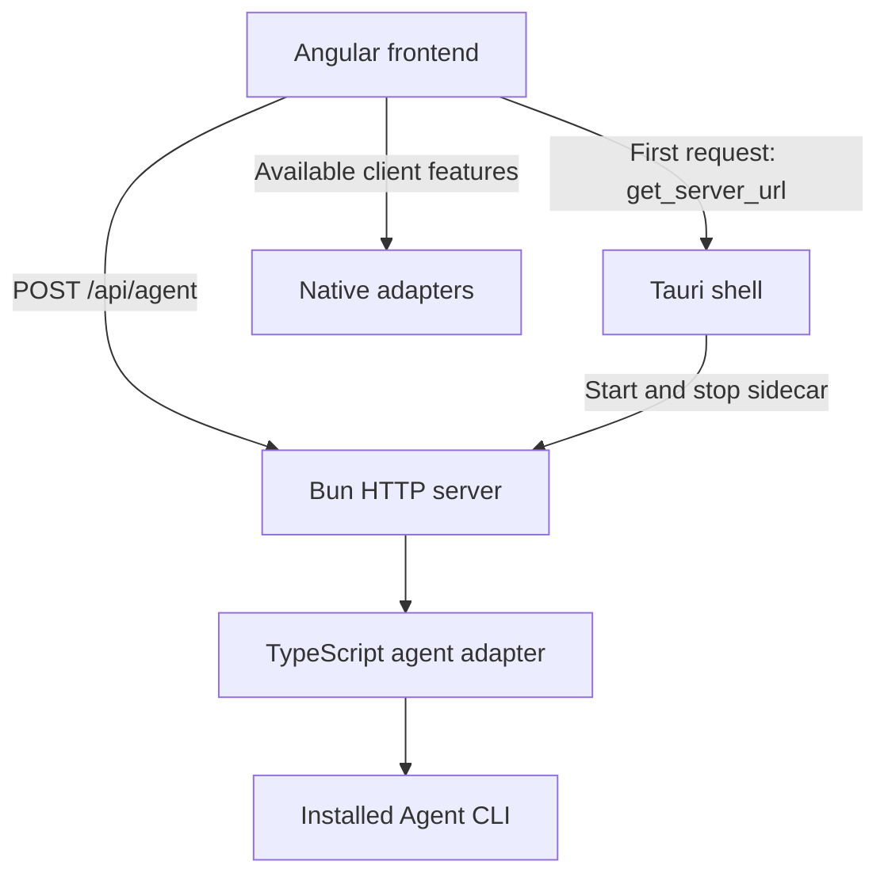

# Architecture

Eitri has an Angular frontend and a TypeScript HTTP backend running on Bun.
The standalone server uses shared Effect contracts and is bundled with `vp pack`.
Bun compiles the bundle into a standalone executable. Tauri ships that executable,
and starts one server per desktop process. The frontend connects directly over HTTP.

## Server direction

Use Bun with Effect HTTP and Effect RPC for the server's transport layer. This keeps
routing, typed calls, and streams in the same Effect stack. Today the server exposes a
single JSON endpoint over HTTP. The client's agent service can call it, but no page
does yet. The RPC and WebSocket parts are the planned next step.

- Use `BunHttpServer` and `HttpRouter` for HTTP, and Effect RPC over WebSockets
  for agent calls and event streams.
- Define payloads, results, expected errors, stream events, and RPC groups in
  `packages/contracts` using Effect Schema. Server handlers and the client
  derive their interface from these shared definitions.
- Keep agent execution and resource cleanup in server services. Encapsulate
  the Effect client in the client adapter so UI components stay focused on
  presentation.

## Current structure

- **Frontend** (`apps/client`): Angular UI shared by the web
  and desktop clients. Folder ownership, pages, commands and panels are described
  in [Client UI](client-ui.md).
  The agent service handles HTTP requests; client adapters resolve the server
  address and isolate native capabilities. The Tauri shell in `apps/client/src-tauri`
  owns the packaged server's lifecycle.
- **Server** (`apps/server`): validates requests, selects the installed Agent CLI,
  passes the prompt through stdin, and returns its completed output. Owns process
  execution, timeouts, and cleanup. Each request starts a fresh conversation.
- **Contracts** (`packages/contracts`): shared schemas, derived types, and endpoint
  constants defining what crosses the client/server boundary. Keep execution and
  application state in the applications.
- **Shared** (`packages/shared`): portable runtime helpers derived from the
  contracts, currently request validation and response decoding. Keep these
  independent of browser, native, and server APIs.
- **UI** (`apps/client/projects/ui`): reusable Spartan Helm controls owned by the client,
  with Storybook examples alongside components and configuration in `apps/client/.storybook`.
  Owns presentation and control interaction; feature state and agent calls belong
  in the client application.

## Runtime

The Angular dev proxy forwards `/api/**` to `127.0.0.1:4318`. Run `vp run dev:server`
alongside `vp run dev:web`, or `vp run dev:desktop`, which starts both beside the shell.
In development the shell starts no sidecar; the frontend reaches the watched server
through the proxy.

`vp pack` bundles JavaScript dependencies into `dist/bin.mjs`; Bun Compile embeds
it with the runtime. The `sidecar` task builds only the requested target and stages
`sidecar/eitri-server-<Rust target>` for `externalBin`. Tauri checks for that file
in every build, development included. macOS universal builds keep the ARM64 and x64
binaries under their own triples, because Tauri builds each architecture separately,
and join them with `lipo`. Neither a separate Bun runtime nor a JavaScript resource
is shipped.

Project workflows, persistent chats, and remote access are not implemented yet.

Keep presentation in the UI and process integration inside the server adapter.
See the [workspace guide](workspace.md) for import conventions.
